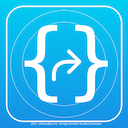
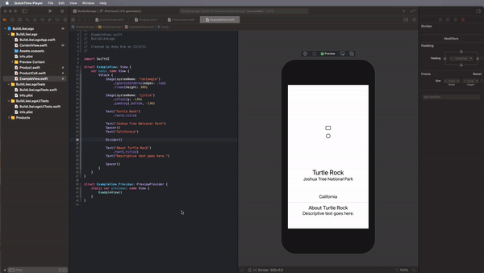

## SwiftUI EmbedIt!

### Xcode Editor Menu

Supporting embed container type: VStack, HStack, ZStack, ScrollView, GeometryReader, List, NavigationView, Generic Container, Group, ForEach

### Demo with Xcode Keybinding - You can quickly embed multiple views

Just select lines that you want to embed and select type to embed from the menu.
You can use keybinding in Xcode preference to make even faster.

